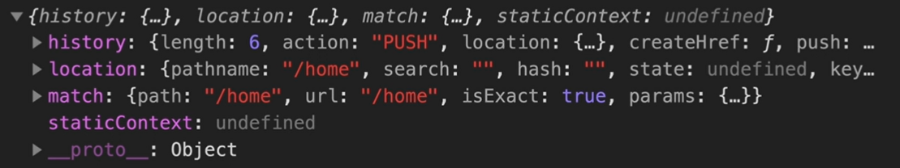

## 作用

**对函数型组件进行增强**, 让其可以存储状态, 可以处理副作用, **实现类似类组件的功能**

### 类组件不足

1. 为了复用逻辑增加了无实际渲染效果的组件, 增加组件层级, 显示臃肿, 增加了调试难度和运行效率的降低
2. **业务逻辑和组件生命周期**不相容, 错落分布, 导致内组件变得复杂难以维护
3. 类成员不能保证this指向的正确性

## 使用

### 内置钩子

#### useState

为函数组件引入状态

1. 唯一参数是初始状态, 或返回初始状态的函数, 该函数只会被调用一次
2. 返回值为数组, 0: 状态值, 1: 更改状态值方法
   1. 使用数组方便用户自定义命名
3. set方法可以被调用多次, 传参的值会被整体赋值到state
   1. 传参也可以是function, 返回新state
   2. set函数是异步的, 需要获取最新count, 则需要在set函数内部进行

```tsx
import { useState } from 'react'

const [count, setCount] = useState(0);

function handleClick() {
  setCount(count => {
    const newCount = count + 1;
    document.title = newCount;
    return newCount;
  })
}

function App() {
  return <div>
    <span>{ count }</span>
    <button onClick={() => handleClick}></button>
  </div>
}
```

useReducer

基于action和reducer的钩子函数

```js
function reducer (state, action) {
  switch (action.type) {
    case '':
      return newState()
  }
}
const [state, dispatch] = useReducer(reducer, 0);
```

#### useContext

简化跨组件获取数据的代码

```tsx
import { createContext, useContext } from 'react'
const context = createContext()
function App() {
  return <context.Provider value={100}><Foo/></context.Provider>
}
function Foo() {
  const value  = useContext(context);
  return <div>{ value }</div>
  /**
  return <context.Consumer>{ value => <div>{ value }</div></context.Consumer>
  */
}
```

#### useEffect

在组件生命周期执行函数:

1. `useEffect(() => {}, [])`
   1. 组件挂载完成后
   2. 第二参数数组中的属性更新后
      1. 不传, 则任何数据更新后都会调用
      2. 传空数组, 则不会在数据更新时调用
2. `useEffect(() => () => {})`, 组件被卸载之前

##### 解决问题

1. 将一组相关业务逻辑放置在了同一个副作用函数中
2. 简化重复代码, 使代码简洁清晰

##### 异步

因为返回值用于清理操作, 而async等会返回promise, 故参数不能是异步函数

需要执行异步, 则需要使用立即执行函数包装: `(async () => await axios.get())()`

```js
import { useEffect } from 'react'

useEffect(() => {
  document.addEventListener(,,,)
  return () => {
    document.removeEventListener(...)
  }
}, [])

```

#### useMemo

类似vue的computed, 会缓存旧值, 依赖的属性不变化就不会重新计算

`const result = useMemo(() => count + 1, [count])`

#### memo

性能优化, 若组件中数据没有变化, 阻止组件更新, 类似`PureComponent`和`shouldComponentUpdate`

```js
import { memo } from 'react'
function Count () { return <div></div> }
export default memo(Counter)
```

#### useCallback

性能优化, 缓存函数, 在组件重新渲染时得到相同的函数实例, 避免接受函数的子组件因为函数变化而重新渲染

```tsx
import { useCallback } from 'react'
function Counter() {
  const resetCount = useCallback(() => setCount(0), [setCount]);
  return <Count reset={resetCount} />
}
```

#### useRef

获取dom实例对象, 先创建ref, 再通过`ref={}`将这个对象赋值给dom元素的ref属性, 最终ref.current 就指向dom元素实例

```js
function App () {
  const ref = useRef();
  return <input ref={ref} />;
}
```

**不是状态数据**, 视图重新渲染不会导致更新, 反过来数据变化也不会导致视图更新

比如函数组件中需要保留`setTimeout`的handlerKey, 但数据更新, 组件重新渲染后就会被重置, 这时候需要新建个ref保存id

```tsx
function App() {
  let timeId = useRef()
  useEffect(() => {
    timeId.current = setInterval(() => {...})
  }, [])
  const stop = () => { clearInterVal(timerId.current) }
}
```

### 自定义Hook

以use开头的函数, 通常是内置hook和业务逻辑的结合封装

```tsx
function useInputValue(init) {
  const [value, setValue] = useState(init);
  return {
    value, onChange: event => setValue(event.target.value);
  }
}

function App() {
  const userName = useInputValue('');
  return <input { ...useName }></input>
}
```

### 路由钩子

`react-router-dom`内置了4个路由相关信息的钩子函数

`import {useHistory, useLocation, useRouteMatch, useParams } from 'react-router-dom'`



## 实现原理

### useState

#### 需求

1. 返回`[state, setState]`
2. 多次调用返回新实例
3. 重新渲染/执行render 不会重新创建实例

#### 实现

每次调用返回对象有对应id, 存储于组件层级, 不会随组件重新渲染而失效

1. 组件范围全局存储state数组
2. 调用时首先看state中有没有值, 有则直接返回
   1. 否则新建state和setter, 存储于最新index上, 并index++
   2. setter中需要得到当前state的index, 所以需要使用闭包
   3. setter调用最后需要重新render
3. 重新渲染组件时不清空state, 但重置index = 0, 

### useEffect

#### 需求

1. 根据第二个参数在不同生命周期调用callback
2. 当且仅当第二参数中的变量发生变化时调用callback

#### 实现

1. 和state一样, 全局存储effect, 保存index. 只不过item变成了 propArray
2. 若没有第二参数, 直接调用callback
   1. 因为函数组件会在渲染时被调用, 同时`useEffect`也就会被调用, 即实现了初次渲染/更新渲染时调用
3. 有第二参数, 根据index在全局state取得上次渲染的数据, 并和当前数据进行对比, 判断是否需要执行callback

### useReducer

其实就是包装了下`useState`

```tsx
function useReducer(reducer, init) {
  const [state, setState] = useState(init);
  function dispatch(state, action) {
    const newState = reducer(state, action);
    setState(newState)
  }
  return [state, dispatch];
}
```

# [Formik](https://formik.org/docs/tutorial#a-simple-newsletter-signup-form)

```js
import { useFormik } from 'formik'
function App () {
  const formik = useFormik({
    initialValues: { username: 'abc', password: '123' },
    validate: values => {
      const errors = {}
      if (!values.username) {
        errors.username = 'user name must not be empty'
      }
      return errors
    },
    onSubmit: values => console.log(values)
  })
}
```

formik会暴露`{ values, handleChange, handleBlur, handleSubmit, values, touched, errors }`等方法和对象, 用于绑定视图和eventHandler

## 配合yup进行表单验证

```js
import * as Yup from 'yup';

useFormik({
  validationSchema: Yup.object({
    username: Yup.string().max(15, 'user name must less than 15 length').required('please input username'),
    password: Yup.string().min(6, "password must higher than 6").required('...')
  })
})
```

## getFieldProps[简化表单代码](https://formik.org/docs/tutorial#getfieldprops)

一个form-item通常需要绑定`value, onChange, onBlur`, 每个组件都写一遍会很麻烦, 可以使用`getFieldProps`方法解构, 减少样板代码

```tsx
<input
  name="username"
  { ...formik.getFieldProps('username') }
/>
// 等效于
<input
  name="password"
  value={formik.values.password}
  onChange={formik.handleChange}
  onBlur={formik.handleBlur}
/>
```

## formik组件

formik也提供了各种组件view, Field默认渲染为input, 通过as改变渲染组件的类型

```tsx
import { Formik, Form, Filed, ErrorMessage } from 'formik';
function App() {
  return 
  <Formik initialValues={init} onSubmit={} validationSchema={} >
   <Form>
    <Field name="username"/>
    <ErrorMessage name="username" />
     
     <Firld name="type" as="select">
       <option value="front">前端</option>
     </Firld>
     
    <input type="submit"/>
  </Form>
    </Formik>
}
```

## useField创建自定义组件

useField方法接受props, 返回数组包裹的两个域`field, meta`. 其中field包含input组件的属性, 比如value, onChange等, meta包含验证信息

```tsx
function MyInput({label, ...props}) {
  const [field, meta] = useField(props);
  return <div>
  <label htmlFor={props.id}>{label}</label>
  <input {...field, ...props} />
    { meta.touched && meta.error ? <span>{ meta.error }</span> : null }
  </div>
}

<MyInput id="password" label="密码" name="password" type="password" />

function MyCheckbox ({ label, ...props }) {
  const [field, { value }, { setValue }] = useField(props);
  const handleChange = () => {
    cosnt set = new Set(value);
    if (set.has(props.value)) {
      set.delete(props.value)
    } else {
      set.add(props.value)
    }
    setValue([...set]);
  }
  return <div>
  	<label />
    <input checked={value.includes(props.value)} type="checkbox" {...props} />
  </div>
}

const initState = { hobbies: [] }
<MyCheckbox value="basketball" label="篮球" name="hobbies" />
```

## 受控组件和非受控组件

非受控组件的value由HTML dom获取, 不能实时获取数据, 但实现相对简单

受控组件value由 state 控制, 通过value和onchange同步到HTML, 可以实时获取数据, 实现相对复杂

| 场景                 | 非受控 | 受控 |
| -------------------- | ------ | ---- |
| 提交时取值           | √      | √    |
| 提交时验证           | √      | √    |
| 表单项实时验证       | ×      | √    |
| 根据条件禁用提交按钮 | ×      | √    |
| 强制输入内容格式     | ×      | √    |
| 一个数据多个输入     | ×      | √    |

